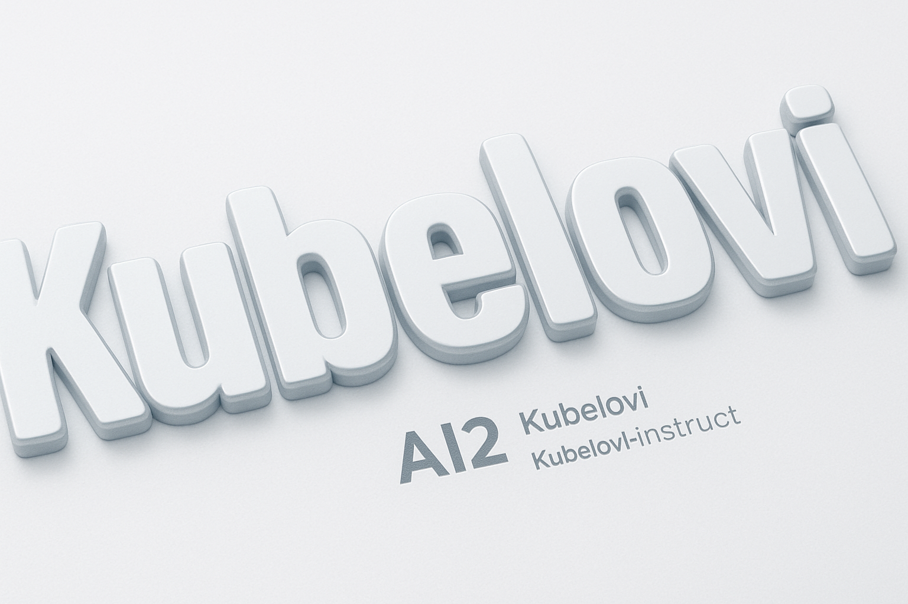

<div align="center">
  
  <br><br>
  <h1>Kubelovi: Kubernetes Log Viewer</h1>
</div>

A modern, web-based application for viewing and managing Kubernetes logs across multiple environments and clusters. Built with React, TypeScript, and Node.js, this application provides a user-friendly interface for developers and DevOps engineers to access container logs, execute commands, and monitor applications running in Kubernetes.

## 🚀 Features

- **Multi-Environment Support**: Connect to multiple Kubernetes clusters and contexts
- **Real-time Log Streaming**: View live logs from pods and containers
- **Interactive Shell Access**: Execute commands directly in containers
- **Advanced Filtering**: Search and filter logs by namespace, pod, container, and time
- **Responsive UI**: Modern, responsive interface built with React and Tailwind CSS
- **Authentication System**: Secure access control with user authentication
- **RBAC Integration**: Leverages Kubernetes RBAC for access control
- **Caching Layer**: Intelligent caching for improved performance
- **Health Monitoring**: Built-in health checks and monitoring

## 🏗️ Architecture

The application follows a microservices architecture with separate frontend and backend components:

```
┌─────────────────┐    ┌─────────────────┐    ┌─────────────────┐
│   Frontend      │    │    Backend      │    │   Kubernetes    │
│   (React)       │◄──►│   (Node.js)     │◄──►│   API Server    │
│                 │    │                 │    │                 │
│ • Log Viewer    │    │ • K8s Client    │    │ • Pod Logs      │
│ • Pod Browser   │    │ • API Gateway   │    │ • Exec Commands │
│ • Auth Portal   │    │ • Caching       │    │ • RBAC          │
└─────────────────┘    └─────────────────┘    └─────────────────┘
```

### Frontend Components
- **LogPortal**: Main entry point with authentication
- **LogBrowser**: Pod and namespace navigation
- **LogViewer**: Real-time log display and filtering
- **LoginForm**: User authentication interface

### Backend Services
- **Kubernetes Client**: Manages connections to K8s clusters
- **API Gateway**: RESTful endpoints for frontend communication
- **Caching Layer**: Redis-like caching for performance optimization
- **RBAC Integration**: Kubernetes role-based access control

## 🛠️ Technology Stack

### Frontend
- **React 18** with TypeScript
- **Vite** for build tooling
- **Tailwind CSS** for styling
- **Radix UI** for accessible components
- **React Query** for data fetching
- **React Router** for navigation

### Backend
- **Node.js** with Express
- **@kubernetes/client-node** for K8s API integration
- **Node-Cache** for in-memory caching
- **CORS** support for cross-origin requests

### Infrastructure
- **Docker** for containerization
- **Kubernetes** for orchestration
- **Helm** for package management
- **Nginx** for reverse proxy
- **GitLab CI/CD** for automation

## 📁 Project Structure

```
kubernetes-log-viewer/
├── src/                    # Frontend React source code
│   ├── components/         # React components
│   ├── pages/             # Page components
│   ├── hooks/             # Custom React hooks
│   └── lib/               # Utility libraries
├── backend/                # Backend Node.js application
│   ├── api/               # Express server and API endpoints
│   └── configs/           # Configuration files
├── k8s/                   # Kubernetes manifests
│   ├── generic-deployment.yaml
│   ├── service.yaml
│   ├── ingress.yaml
│   ├── rbac.yaml
│   └── namespace.yaml
├── helm/                   # Helm chart for deployment
│   ├── templates/          # Helm template files
│   ├── Chart.yaml
│   └── values.yaml
├── nginx/                  # Nginx configuration
├── docker-compose.yml      # Docker Compose for local development
├── Dockerfile             # Multi-stage Docker build
└── package.json           # Frontend dependencies
```

## 🚀 Quick Start

### Prerequisites
- Node.js 18+ and npm
- Docker and Docker Compose
- Kubernetes cluster access
- kubectl configured

### Local Development
```bash
# Clone the repository
git clone <repository-url>
cd kubernetes-log-viewer

# Install frontend dependencies
npm install

# Install backend dependencies
cd backend && npm install && cd ..

# Start development server
npm run dev

# In another terminal, start backend
cd backend && npm run dev
```

### Docker Deployment
```bash
# Build and run with Docker Compose
docker-compose up --build

# Access the application at http://localhost:8080
```

### Kubernetes Deployment
```bash
# Create namespace
kubectl apply -f k8s/namespace.yaml

# Apply RBAC
kubectl apply -f k8s/rbac.yaml

# Deploy application
kubectl apply -f k8s/generic-deployment.yaml

# Apply service and ingress
kubectl apply -f k8s/service.yaml
kubectl apply -f k8s/ingress.yaml
```

### Helm Deployment
```bash
# Install Helm chart
helm install log-browser ./helm

# Or upgrade existing installation
helm upgrade log-browser ./helm
```

## 🔐 Authentication

The application includes a demo authentication system:
- **Username**: `devuser`
- **Password**: `devpass`

**Note**: This is for demonstration purposes only. In production, implement proper authentication with OAuth, LDAP, or Kubernetes service accounts.

## 📊 Monitoring and Health Checks

### Health Endpoints
- **Frontend**: `GET /` - Application health check
- **Backend**: `GET /api/health` - API health status

### Kubernetes Probes
- **Liveness Probe**: Ensures application is running
- **Readiness Probe**: Ensures application is ready to serve traffic

## 🔧 Configuration

### Environment Variables
- `NODE_ENV`: Environment mode (development/production)
- `PORT`: Backend server port (default: 3001)
- `KUBECONFIG`: Path to Kubernetes configuration file

### Kubernetes RBAC
The application requires the following permissions:
- List and watch pods and namespaces
- Read pod logs
- Execute commands in containers
- Attach to running containers

## 🚀 Deployment Options

1. **Docker Compose**: For local development and testing
2. **Kubernetes Manifests**: For direct K8s deployment
3. **Helm Chart**: For production deployments with customization
4. **GitLab CI/CD**: Automated deployment pipeline

## 📚 Documentation

- [Docker Deployment Guide](docs/DOCKER.md)
- [Kubernetes Deployment Guide](docs/KUBERNETES.md)
- [Helm Chart Documentation](docs/HELM.md)
- [API Reference](docs/API.md)

## 🤝 Contributing

1. Fork the repository
2. Create a feature branch
3. Make your changes
4. Add tests if applicable
5. Submit a pull request

## 📄 License

This project is licensed under the MIT License - see the [LICENSE](LICENSE) file for details.

## 🆘 Support

For support and questions:
- Create an issue in the GitHub repository
- Check the documentation in the `docs/` folder
- Review the troubleshooting guide

## 🔄 Version History

- **v1.0.0**: Initial release with basic log viewing capabilities
- **v2.0.0**: Added multi-environment support and RBAC integration
- **v3.0.0**: Enhanced UI with modern components and improved performance

